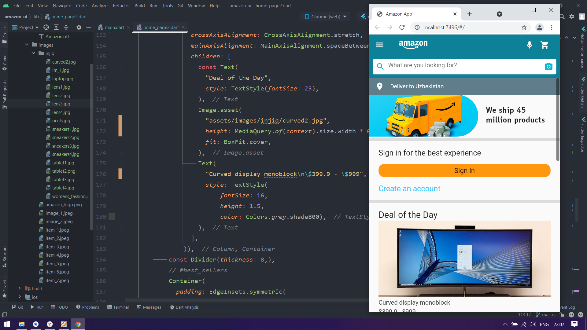

# amazon_ui

Amazon shop appning eski versiyasi kloni
`

Darsda berilgan shartga ko'ra shakllantrilidi

home: HomePage2 ga ulangan. unda yangi uy vazifasi qilingan. Darsdagi holati esa HomePage1 da.

- [Lab: Write your first Flutter app](https://flutter.dev/docs/get-started/codelab)
- [Cookbook: Useful Flutter samples](https://flutter.dev/docs/cookbook)

For help getting started with Flutter, view our
[online documentation](https://flutter.dev/docs), which offers tutorials,
samples, guidance on mobile development, and a full API reference.
